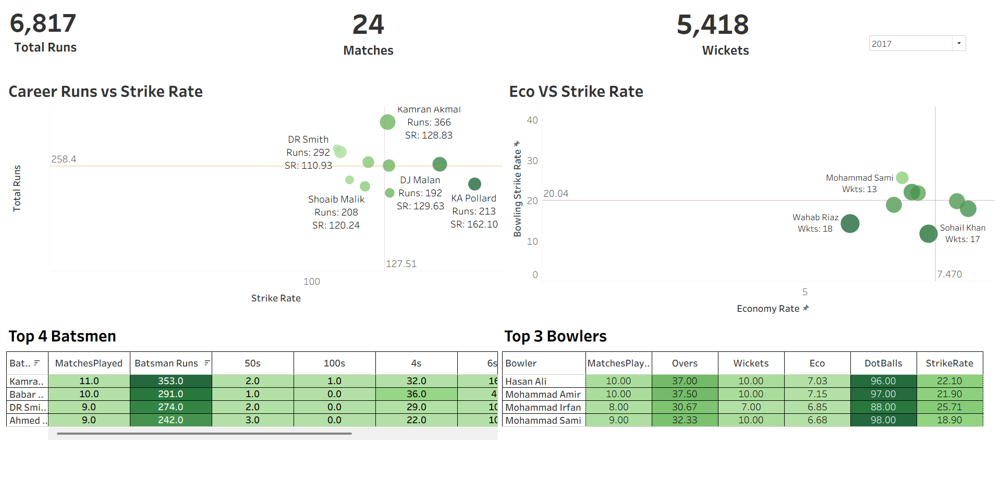

#  PSL Player Performance Analysis

##  Project Overview
This project analyzes player performance in the Pakistan Super League (PSL) using a structured data pipeline and interactive dashboard. The objective is to evaluate batsmen and bowlers using key performance metrics and provide actionable insights.

---

##  Data Pipeline
The project follows a multi-layered data approach:

- **Raw Data** → Original dataset downloaded from Kaggle  
- **Processed Data** → Cleaned and transformed dataset  
- **Data Warehouse** → Structured tables for analysis  

---

##  Tools & Technologies
- **SQL** → Data cleaning, transformation, and analysis  
- **Tableau** → Dashboard development and visualization  
- **Excel/CSV** → Data storage  

---

##  Key Metrics
- Batting Strike Rate  
- Batting Average  
- Total Runs  
- Bowling Economy  
- Wickets Taken  

---

##  Dashboard Features
- Player performance comparison (batsmen vs bowlers)  
- Scatter plots for Strike Rate vs Average  
- Economy vs Wickets analysis for bowlers  
- Interactive filters for dynamic exploration  

---

##  Key Insights
- Identified top-performing batsmen with high strike rate and consistency  
- Highlighted bowlers with low economy and strong wicket-taking ability  
- Observed performance differences across player roles  

---

##  Dashboard Preview

---

##  Project Structure
- `data/raw/` → Original dataset  
- `data/processed/` → Cleaned data  
- `data/warehouse/` → Final structured data  
- `sql/` → SQL scripts for pipeline and analysis  
- `dashboard/` → Tableau workbook  
- `images/` → Dashboard screenshots  

---

##  Future Improvements
- Automate data pipeline using Python  
- Add match-level and team-level analysis  
- Deploy dashboard online  

---

## 👤 Author
Najeeb Ullah
